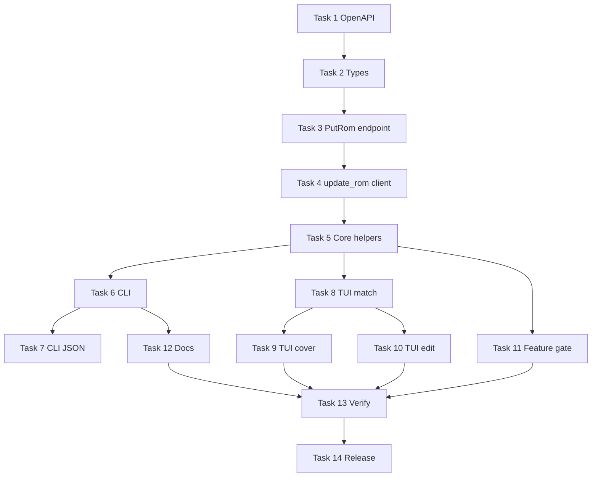

# Game metadata editing (v1) implementation plan

> **For Claude:** REQUIRED SUB-SKILL: Use superpowers:executing-plans to implement this plan task-by-task.

**Goal:** Add match/unmatch and edit name/summary/cover for ROMs across `romm-api`, `romm-cli`, and `romm-tui`, using RomM’s REST API so no client-side metadata API keys are required.

**Architecture:** Extend `romm-api` with typed search results, a `PutRom` multipart endpoint, and `RommClient::update_rom`. CLI exposes `roms metadata {search,match,edit,unmatch,remove-cover}` with JSON output and optional interactive pickers on TTY. TUI adds a separate “Match metadata” flow on game detail (not merged with existing user-props). After successful writes, invalidate the platform’s `RomCache` entry and refresh the in-memory ROM.

**Tech stack:** Rust 2021, `reqwest` multipart, `serde`/`serde_json`, `clap`, `dialoguer`, `ratatui`, `httpmock` integration tests.

**Decisions (locked):**

| # | Choice |
|---|--------|
| v1 scope | Match/unmatch + `name` / `summary` / cover (`url_cover`, `artwork` file, `remove_cover`) |
| User props | Keep separate from game metadata (existing `roms props`; no TUI merge) |
| CLI UX | Scriptable subcommands + interactive picker when stdout is a TTY |
| Bulk rescrape | Out of scope v1 |
| Response typing | Typed `SearchRom` / `SearchCover`; `RomUpdateResponse` with common fields + `extra: Value` for provider blobs |
| Transport | Always `multipart/form-data` for `PUT /api/roms/{id}` |
| Min RomM | 4.8+ (`PUT` typed forms); refresh bundled OpenAPI |
| Cover search | Optional step in match flow; skip when SGDB disabled |

**Out of scope v1:** `fs_name` rename, `url_manual`, raw `*_metadata` JSON, bulk scan/WebSocket, platform `PUT`, notes changes.

**Reference:** [2026-06-26-metadata-editing-research.md](2026-06-26-metadata-editing-research.md)

---

## Task 0: Worktree and branch

**Step 1:** Create an isolated worktree (see @using-git-worktrees).

```bash
git worktree add ../romm-cli-metadata -b feat/metadata-editing-v1
cd ../romm-cli-metadata
```

**Step 2:** Verify baseline checks pass:

```bash
cargo fmt --check
cargo clippy --all-targets --all-features -- -D warnings
cargo test
```

Expected: all green before feature work.

---

## Task 1: Refresh bundled OpenAPI snapshot

**Files:**
- Modify: `romm-tui/openapi.json` (replace from RomM 4.9.x demo or your instance)
- Modify: `romm-api/tests/openapi_registry.rs` (only if fixture paths change)
- Modify: `docs/compatibility.toml` (new row when versions ship)

**Step 1:** Fetch current spec (demo or local RomM):

```bash
curl -fsS https://demo.romm.app/openapi.json -o romm-tui/openapi.json
```

**Step 2:** Confirm `PUT /api/roms/{id}` body lists `igdb_id`, `name`, `summary`, `url_cover`, `artwork`:

```bash
python -c "import json; s=json.load(open('romm-tui/openapi.json')); print(list(s['components']['schemas']['Body_update_rom_api_roms__id__put']['properties'].keys()))"
```

Expected: includes `igdb_id`, `name`, `summary`, `url_cover`, `artwork`, …

**Step 3:** Run OpenAPI registry test:

```bash
cargo test -p romm-api openapi_registry -- --nocapture
```

Expected: PASS

**Step 4:** Commit

```bash
git add romm-tui/openapi.json
git commit -m "chore(api): refresh bundled OpenAPI for metadata PUT fields"
```

---

## Task 2: Typed search models (`romm-api`)

**Files:**
- Create: `romm-api/src/types/metadata.rs`
- Modify: `romm-api/src/types.rs` (re-export)
- Modify: `romm-api/src/lib.rs` (pub use if needed)
- Test: `romm-api/src/types/metadata.rs` (`#[cfg(test)]` module)

**Step 1: Write the failing test**

Add at bottom of `romm-api/src/types/metadata.rs`:

```rust
#[cfg(test)]
mod tests {
    use super::*;

    #[test]
    fn search_rom_deserializes_demo_shape() {
        let json = r#"{
            "name": "Super Mario Bros.",
            "slug": "super-mario-bros",
            "summary": "A platformer.",
            "platform_id": 1,
            "igdb_id": 1234,
            "ss_id": null,
            "moby_id": null,
            "is_identified": true,
            "is_unidentified": false,
            "igdb_url_cover": "https://example.com/cover.jpg"
        }"#;
        let row: SearchRom = serde_json::from_str(json).unwrap();
        assert_eq!(row.name, "Super Mario Bros.");
        assert_eq!(row.igdb_id, Some(1234));
    }
}
```

**Step 2: Run test to verify it fails**

```bash
cargo test -p romm-api search_rom_deserializes -- --nocapture
```

Expected: FAIL (module/type missing)

**Step 3: Write minimal implementation**

`romm-api/src/types/metadata.rs`:

```rust
use serde::{Deserialize, Serialize};
use serde_json::Value;

/// Row from `GET /api/search/roms`.
#[derive(Debug, Clone, Deserialize, Serialize, PartialEq)]
pub struct SearchRom {
    pub name: String,
    #[serde(default)]
    pub slug: Option<String>,
    #[serde(default)]
    pub summary: Option<String>,
    pub platform_id: u64,
    #[serde(default)]
    pub igdb_id: Option<i64>,
    #[serde(default)]
    pub moby_id: Option<i64>,
    #[serde(default)]
    pub ss_id: Option<i64>,
    #[serde(default)]
    pub launchbox_id: Option<i64>,
    #[serde(default)]
    pub flashpoint_id: Option<String>,
    #[serde(default)]
    pub sgdb_id: Option<i64>,
    #[serde(default)]
    pub is_identified: bool,
    #[serde(default)]
    pub is_unidentified: bool,
    #[serde(default)]
    pub igdb_url_cover: Option<String>,
    #[serde(default)]
    pub ss_url_cover: Option<String>,
    #[serde(default)]
    pub moby_url_cover: Option<String>,
    #[serde(flatten)]
    pub extra: Value,
}

impl SearchRom {
    /// Best provider ID to send to `PUT /api/roms/{id}` (first non-null in UI priority order).
    pub fn primary_match_fields(&self) -> RomMatchFields {
        RomMatchFields {
            igdb_id: self.igdb_id,
            moby_id: self.moby_id,
            ss_id: self.ss_id,
            launchbox_id: self.launchbox_id,
            flashpoint_id: self.flashpoint_id.clone(),
            sgdb_id: self.sgdb_id,
        }
    }
}

#[derive(Debug, Clone, Default, Serialize)]
pub struct RomMatchFields {
    pub igdb_id: Option<i64>,
    pub moby_id: Option<i64>,
    pub ss_id: Option<i64>,
    pub launchbox_id: Option<i64>,
    pub flashpoint_id: Option<String>,
    pub sgdb_id: Option<i64>,
}

#[derive(Debug, Clone, Deserialize, Serialize)]
pub struct SearchCover {
    pub name: String,
    #[serde(default)]
    pub resources: Vec<SgdbResource>,
}

#[derive(Debug, Clone, Deserialize, Serialize)]
pub struct SgdbResource {
    #[serde(default)]
    pub width: Option<u32>,
    #[serde(default)]
    pub height: Option<u32>,
    #[serde(default)]
    pub url: Option<String>,
    #[serde(flatten)]
    pub extra: Value,
}

/// Subset of `DetailedRomSchema` returned by `PUT /api/roms/{id}`.
#[derive(Debug, Clone, Deserialize, Serialize)]
pub struct RomUpdateResponse {
    pub id: u64,
    pub platform_id: u64,
    #[serde(default)]
    pub name: Option<String>,
    #[serde(default)]
    pub summary: Option<String>,
    #[serde(default)]
    pub url_cover: Option<String>,
    #[serde(default)]
    pub path_cover_small: Option<String>,
    #[serde(default)]
    pub path_cover_large: Option<String>,
    #[serde(default)]
    pub is_identified: bool,
    #[serde(default)]
    pub is_unidentified: bool,
    #[serde(flatten)]
    pub extra: Value,
}
```

Wire `pub mod metadata;` in `types.rs` and re-export key types.

**Step 4: Run test**

```bash
cargo test -p romm-api search_rom_deserializes -- --nocapture
```

Expected: PASS

**Step 5: Commit**

```bash
git add romm-api/src/types/
git commit -m "feat(api): add SearchRom and RomUpdateResponse types"
```

---

## Task 3: `PutRom` endpoint + typed search outputs

**Files:**
- Modify: `romm-api/src/endpoints/roms.rs`
- Test: `romm-api/src/endpoints/roms.rs` (`mod tests`)

**Step 1: Write failing tests**

```rust
#[test]
fn put_rom_path_and_query() {
    use super::{Endpoint, PutRom};
    let ep = PutRom {
        rom_id: 42,
        remove_cover: true,
        unmatch_metadata: false,
        fields: Default::default(),
        artwork: None,
    };
    assert_eq!(ep.method(), "PUT");
    assert_eq!(ep.path(), "/api/roms/42");
    let q = ep.query();
    assert!(q.iter().any(|(k, v)| k == "remove_cover" && v == "true"));
}

#[test]
fn get_search_roms_output_deserializes_list() {
    // uses Endpoint::Output = Vec<SearchRom> once wired
}
```

**Step 2: Run tests — expect FAIL**

```bash
cargo test -p romm-api put_rom_path -- --nocapture
```

**Step 3: Implement**

Add to `romm-api/src/endpoints/roms.rs`:

```rust
use crate::types::metadata::{RomMatchFields, RomUpdateResponse, SearchCover, SearchRom};

/// Fields for `PUT /api/roms/{id}` multipart body (partial update).
#[derive(Debug, Clone, Default)]
pub struct RomUpdateFields {
    pub name: Option<String>,
    pub summary: Option<String>,
    pub url_cover: Option<String>,
    pub match_fields: RomMatchFields,
}

#[derive(Debug, Clone)]
pub struct PutRom {
    pub rom_id: u64,
    pub fields: RomUpdateFields,
    pub remove_cover: bool,
    pub unmatch_metadata: bool,
    /// Local path read by client when uploading cover file.
    pub artwork: Option<std::path::PathBuf>,
}

impl Endpoint for PutRom {
    type Output = RomUpdateResponse;
    // method PUT, path, query for remove_cover / unmatch_metadata
    // body: None — client uses multipart helper instead of generic call()
}

// Change GetSearchRoms::Output to Vec<SearchRom>
// Change GetSearchCover::Output to Vec<SearchCover>
```

Note: `RommClient::call` cannot send multipart files; `PutRom` is still useful for path/query typing; actual HTTP lives in `client/upload.rs` (Task 4).

**Step 4: Run tests — PASS**

**Step 5: Commit**

```bash
git commit -m "feat(api): add PutRom endpoint and typed search outputs"
```

---

## Task 4: `RommClient::update_rom` multipart helper

**Files:**
- Modify: `romm-api/src/client/upload.rs` (or new `romm-api/src/client/rom_update.rs`)
- Modify: `romm-api/src/client/mod.rs`
- Test: `romm-api/src/client/rom_update.rs` (unit test for form field list)

**Step 1: Write failing unit test** — pure function building multipart part names:

```rust
pub(crate) fn rom_update_form_parts(fields: &RomUpdateFields) -> Vec<(String, String)> {
    let mut out = Vec::new();
    if let Some(ref n) = fields.name {
        out.push(("name".into(), n.clone()));
    }
    // ... match_fields: only push keys that are Some
    out
}

#[test]
fn form_parts_include_only_set_fields() {
    let fields = RomUpdateFields {
        name: Some("Foo".into()),
        summary: None,
        url_cover: None,
        match_fields: RomMatchFields { igdb_id: Some(99), ..Default::default() },
    };
    let parts = rom_update_form_parts(&fields);
    assert!(parts.contains(&("name".into(), "Foo".into())));
    assert!(parts.contains(&("igdb_id".into(), "99".into())));
    assert!(!parts.iter().any(|(k, _)| k == "summary"));
}
```

**Step 2: Run — FAIL**

**Step 3: Implement `update_rom`**

```rust
impl RommClient {
    pub async fn update_rom(&self, ep: &PutRom) -> Result<RomUpdateResponse, ApiError> {
        let url = format!(
            "{}{}",
            self.base_url.trim_end_matches('/'),
            ep.path()
        );
        let mut form = multipart::Form::new();
        for (k, v) in rom_update_form_parts(&ep.fields) {
            form = form.text(k, v);
        }
        if let Some(ref path) = ep.artwork {
            let bytes = tokio::fs::read(path).await.map_err(/* Io */)?;
            let fname = path.file_name().and_then(|n| n.to_str()).unwrap_or("artwork.png");
            let part = multipart::Part::bytes(bytes).file_name(fname.to_string());
            form = form.part("artwork", part);
        }
        // append query ?remove_cover=&unmatch_metadata=
        let resp = self.http.put(&url).headers(self.build_headers()?).multipart(form).query(&ep.query_pairs()).send().await?;
        // decode RomUpdateResponse or ApiError
    }
}
```

For `unmatch_metadata=true`, send empty multipart (body ignored by server).

**Step 4: Run unit test — PASS**

**Step 5: Commit**

```bash
git commit -m "feat(api): add RommClient::update_rom multipart helper"
```

---

## Task 5: Core helpers — parse search, cache invalidation, feature gate

**Files:**
- Create: `romm-api/src/core/metadata.rs`
- Modify: `romm-api/src/core/mod.rs`
- Modify: `romm-api/src/feature_compat.rs`
- Test: `romm-api/src/core/metadata.rs`

**Step 1: Write failing test for cache invalidation**

```rust
#[test]
fn invalidate_rom_cache_for_platform_removes_key() {
    // use RomCache temp dir pattern from existing cache tests
}
```

**Step 2: Implement**

```rust
pub fn invalidate_platform_rom_cache(platform_id: u64) {
    let mut c = RomCache::load();
    c.remove(&RomCacheKey::Platform(platform_id));
}

pub async fn search_metadata_matches(
    client: &RommClient,
    rom_id: u64,
    search_term: Option<String>,
    search_by: Option<String>,
) -> Result<Vec<SearchRom>, ApiError> {
    client.call(&GetSearchRoms { rom_id, search_term, search_by }).await
}
```

Add to `feature_compat.rs`:

```rust
pub const METADATA_EDIT_FEATURE: &str = "metadata-edit";
pub const METADATA_EDIT_REQUIRED: [RequiredEndpoint; 3] = [
    RequiredEndpoint { method: "GET", path: "/api/search/roms" },
    RequiredEndpoint { method: "PUT", path: "/api/roms/{id}" },
    RequiredEndpoint { method: "GET", path: "/api/roms/{id}" },
];
```

**Step 3: Run tests — PASS**

**Step 4: Commit**

```bash
git commit -m "feat(api): metadata search helper, cache invalidation, feature gate"
```

---

## Task 6: CLI — `roms metadata` subcommand group

**Files:**
- Create: `romm-cli/src/commands/metadata.rs`
- Modify: `romm-cli/src/commands/roms.rs` (add `Metadata` variant to `RomsAction` or nest under `roms metadata`)
- Modify: `romm-cli/src/commands/mod.rs`
- Test: `romm-cli/tests/cli_metadata.rs`

**Subcommands:**

| Command | API | Notes |
|---------|-----|-------|
| `roms metadata search <id> --query Q` | `GET /api/search/roms` | `--search-by name\|id`, `--json` |
| `roms metadata match <id>` | `PUT /api/roms/{id}` | `--igdb-id`, `--ss-id`, …; `--pick` interactive |
| `romm metadata edit <id>` | `PUT` | `--name`, `--summary`, `--url-cover`, `--artwork PATH` |
| `roms metadata unmatch <id>` | `PUT ?unmatch_metadata=true` | `--yes` skip confirm |
| `roms metadata remove-cover <id>` | `PUT ?remove_cover=true` | |

**Step 1: Write failing integration test** (`cli_metadata.rs`):

```rust
#[tokio::test]
async fn metadata_search_calls_search_roms() {
    let server = MockServer::start_async().await;
    let mock = server.mock_async(|when, then| {
        when.method(GET)
            .path("/api/search/roms")
            .query_param("rom_id", "1")
            .query_param("search_term", "mario");
        then.status(200).body(r#"[{"name":"Mario","platform_id":1,"is_identified":true,"is_unidentified":false}]"#);
    }).await;
    // run: romm-cli roms metadata search 1 --query mario --json
    mock.assert();
}
```

**Step 2: Run — FAIL**

**Step 3: Implement `metadata.rs`**

Interactive match when `--pick` or when no provider flags and TTY:

```rust
fn pick_search_result(rows: &[SearchRom]) -> Result<usize> {
    let labels: Vec<String> = rows.iter().map(|r| format!("{} (igdb:{:?} ss:{:?})", r.name, r.igdb_id, r.ss_id)).collect();
    let sel = dialoguer::Select::new().items(&labels).default(0).interact()?;
    Ok(sel)
}
```

After successful `match` / `edit` / `unmatch`, call `invalidate_platform_rom_cache(platform_id)` when platform_id known from response.

**Step 4: Run integration tests — PASS**

```bash
cargo test -p romm-cli cli_metadata -- --nocapture
```

**Step 5: Deprecation note** — keep `roms cover-search` working; add `after_help` pointing to `roms metadata search`.

**Step 6: Commit**

```bash
git commit -m "feat(cli): add roms metadata search/match/edit/unmatch commands"
```

---

## Task 7: CLI — JSON output and shell completions

**Files:**
- Modify: `romm-cli/src/commands/metadata.rs`
- Regenerate: completions if the project has a completion generation step

**Step 1:** Ensure `--json` / global `--json` prints pretty `SearchRom[]` or `RomUpdateResponse`.

**Step 2:** Run `cargo test -p romm-cli` and fix clippy.

**Step 3: Commit**

```bash
git commit -m "feat(cli): JSON output for metadata subcommands"
```

---

## Task 8: TUI — metadata match picker screen

**Files:**
- Create: `romm-tui/src/tui/screens/metadata_match/mod.rs`
- Create: `romm-tui/src/tui/screens/metadata_match/types.rs`
- Create: `romm-tui/src/tui/screens/metadata_match/render.rs`
- Modify: `romm-tui/src/tui/screens/mod.rs`
- Modify: `romm-tui/src/tui/app/handlers/game_detail.rs`
- Modify: `romm-tui/src/tui/app/handlers/screen_keys.rs`
- Modify: `romm-tui/src/tui/keyboard_help.rs`
- Test: `romm-tui/src/tui/screens/metadata_match/tests.rs` (state transitions)

**UX (v1):**

- Game detail: **`m`** opens “Match metadata” (not merged with user props).
- Flow: inline query input → background `search_metadata_matches` → list picker → confirm → `update_rom` with selected `RomMatchFields` → invalidate cache → reload ROM + cover.
- **`u`** on game detail: “Unmatch” with `Confirm` dialog.
- **`e`** (optional v1 stretch): simple edit overlay for name/summary only; defer if timeboxed.

**Step 1: Write unit test** — picker selection maps to `RomMatchFields`:

```rust
#[test]
fn selected_row_builds_match_fields() {
    let row = SearchRom { igdb_id: Some(5), ..fixture() };
    let fields = row.primary_match_fields();
    assert_eq!(fields.igdb_id, Some(5));
}
```

**Step 2: Implement screen + handler** (mirror `ExtrasPickerScreen` / `PathPicker` patterns).

**Step 3: Wire background task** in `app/background/tasks.rs` for search + apply.

**Step 4: Footer hints** — add `m` / `u` to game detail footer via `footer_hint.rs`.

**Step 5: Run TUI tests**

```bash
cargo test -p romm-tui metadata_match -- --nocapture
```

**Step 6: Commit**

```bash
git commit -m "feat(tui): metadata match and unmatch from game detail"
```

---

## Task 9: TUI — optional SteamGridDB cover step

**Files:**
- Modify: `romm-tui/src/tui/screens/metadata_match/` (after match confirm, if `STEAMGRIDDB_API_ENABLED` from heartbeat)
- Modify: `romm-api/src/core/metadata.rs` — `search_covers(client, term)`

**Step 1:** Read `METADATA_SOURCES.STEAMGRIDDB_API_ENABLED` from last heartbeat cache (existing startup path).

**Step 2:** After provider match succeeds, if user presses `c` in picker or a “Change cover” prompt: `GET /api/search/cover` → pick URL → second `update_rom` with `url_cover` only.

**Step 3:** If SGDB disabled, skip step silently.

**Step 4: Commit**

```bash
git commit -m "feat(tui): optional SGDB cover pick after metadata match"
```

---

## Task 10: TUI — edit name/summary (minimal)

**Files:**
- Modify: `romm-tui/src/tui/screens/game_detail/` or small `metadata_edit` overlay
- Modify: `romm-tui/src/tui/app/handlers/game_detail.rs`

**Step 1:** `E` opens two-field editor (name line, summary multiline) — reuse settings screen input patterns.

**Step 2:** On save, `update_rom` with only changed fields; refresh display.

**Step 3: Commit**

```bash
git commit -m "feat(tui): edit ROM name and summary from game detail"
```

---

## Task 11: Feature compatibility check at startup (TUI)

**Files:**
- Modify: `romm-tui/src/tui/openapi_sync.rs` or startup path
- Modify: `romm-api/src/feature_compat.rs`

**Step 1:** After OpenAPI sync, if `metadata-edit` unsupported, disable `m`/`e`/`u` keys and show one-time footer hint.

**Step 2: Commit**

```bash
git commit -m "feat(tui): gate metadata edit on OpenAPI feature compatibility"
```

---

## Task 12: Documentation and compatibility matrix

**Files:**
- Create: `docs/metadata-editing.md`
- Modify: `docs/cli.md` or `README.md` (link)
- Modify: `docs/tui.md` (keyboard section)
- Modify: `docs/compatibility.toml` (new combination row when releasing)
- Modify: crate `CHANGELOG.md` files (Release Please will pick up conventional commits)

**Content for `docs/metadata-editing.md`:**

- Prerequisites: RomM 4.8+, `roms.write` scope
- CLI examples for each subcommand
- TUI keys: `m`, `u`, `e`, optional cover step
- Explicit “bulk rescrape not in v1 — use RomM web UI”
- No client API keys required

**Step 1: Write docs**

**Step 2: Commit**

```bash
git commit -m "docs: add metadata editing user guide"
```

---

## Task 13: Full verification (@verification-before-completion)

**Step 1:** Pre-commit sequence (repo rule):

```bash
cargo fmt
cargo fmt --check
cargo clippy --all-targets --all-features -- -D warnings
cargo clippy --all-targets --no-default-features -- -D warnings
cargo test
```

Expected: all exit 0.

**Step 2:** Manual smoke (real RomM instance):

```bash
romm-cli roms metadata search 123 --query "zelda"
romm-cli roms metadata match 123 --igdb-id 1234
romm-cli roms metadata edit 123 --summary "My summary"
romm-cli roms metadata unmatch 123 --yes
```

TUI: open game detail → `m` → pick → confirm → verify cover/title update.

---

## Task 14: Version bumps (when merging)

Add to `docs/compatibility.toml`:

```toml
[[combination]]
romm_cli = "1.2.0"   # example — match actual release
romm_tui = "1.3.0"
min_romm_api = "1.2.0"
notes = "ROM metadata match/edit via RomM search and PUT endpoints"
```

Bump `romm-api` / `romm-cli` / `romm-tui` `Cargo.toml` versions per [docs/releases.md](../releases.md).

---

## Dependency graph



Tasks 6 (CLI) and 8–11 (TUI) can proceed in parallel after Task 5.

---

## Execution handoff

Plan complete and saved to `docs/plans/2026-06-26-metadata-editing.md`.

**Two execution options:**

1. **Subagent-Driven (this session)** — dispatch a fresh subagent per task, review between tasks (@subagent-driven-development).
2. **Parallel Session (separate)** — open a new session in the worktree with @executing-plans, batch execution with checkpoints.

Which approach do you want?
