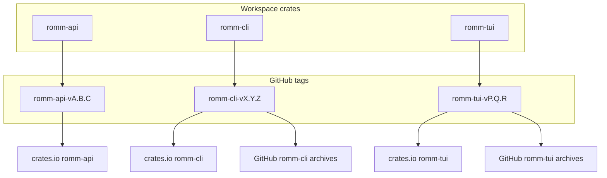

# Release runbook

This workspace ships three independently versioned crates plus prebuilt desktop binaries. See [release coordination design](plans/2026-06-06-release-coordination-design.md) for rationale.

## Current line: 1.0.0

All workspace crates target **1.0.0** as the post-split fresh start. Component tags:

| Crate | Tag | crates.io | GitHub binaries |
|-------|-----|-----------|-----------------|
| `romm-api` | `romm-api-v1.0.0` | Yes | — |
| `romm-cli` | `romm-cli-v1.0.0` | Yes | Yes |
| `romm-tui` | `romm-tui-v1.0.0` | Yes | Yes |

Legacy tags (`v0.x.y` unified, `romm-*-v0.40.0` bootstrap) remain for history but are not the supported line.

## Overview



Automation:

- [Release Please](../.github/workflows/release-please.yml) — release PRs + crates.io publish (`romm-api` first, then `romm-tui` and `romm-cli` in parallel)
- [Release Artifacts](../.github/workflows/release-artifacts.yml) — frontend binaries and checksums only

## Day-to-day development

1. Use [Conventional Commits](https://www.conventionalcommits.org/) with scopes that match the crate:
   - `feat(api):` / `romm-api/` → bumps `romm-api`
   - `feat(cli):` / `romm-cli/` → bumps `romm-cli`
   - `feat(tui):` / `romm-tui/` → bumps `romm-tui`
2. Merge feature PRs to `main`. Release Please opens a combined **release PR** only for components with qualifying commits.
3. Review the release PR for version bumps, dependency pin updates, and changelog entries.

## Changelog scopes

Each crate changelog contains **only that crate's changes**. Use conventional-commit scopes so Release Please routes entries correctly:

| Scope / area | Changelog | Examples |
|--------------|-----------|----------|
| `romm-api`, `api`, `config`, `download`, `sync`, `client`, shared errors | [romm-api/CHANGELOG.md](../romm-api/CHANGELOG.md) | HTTP endpoints, config merge, download manager |
| `romm-cli`, `cli`, `completions`, `auth`, `init`, CLI `roms`/`scan`/`cache` | [romm-cli/CHANGELOG.md](../romm-cli/CHANGELOG.md) | Subcommands, `--json`, shell completions |
| `romm-tui`, `tui`, `settings`, `setup-wizard`, screens, theming | [romm-tui/CHANGELOG.md](../romm-tui/CHANGELOG.md) | Library UI, game detail, keyboard navigation |

User-facing docs follow the same split: [docs/api.md](api.md), [docs/cli.md](cli.md), and [docs/tui.md](tui.md) each document their crate only. The root [README](../README.md) is a workspace index; screenshots and TUI features live on [tui.md](tui.md).

Pre-1.0.0 history was a single monolith. Entries before the split were filtered into per-crate changelogs by scope (`./tools/split-crate-changelogs.py`). New commits should land in the correct crate changelog automatically via Release Please.

## Release checklist

Before merging a release PR:

- [ ] CI is green (fmt, clippy, tests, release preflight)
- [ ] Dependent `Cargo.toml` files show updated `romm-api` pins where applicable
- [ ] Per-crate changelogs look correct
- [ ] If crate versions diverge, add a row to [`docs/compatibility.toml`](compatibility.toml)

After merging:

- [ ] Component tag(s) exist (`romm-<crate>-v*`)
- [ ] [Release Please publish job](../.github/workflows/release-please.yml) completed (`publish-crates-io`)
- [ ] [Release Artifacts](../.github/workflows/release-artifacts.yml) completed for frontend tags
- [ ] crates.io shows the new version(s)
- [ ] Smoke test: download archives and run `romm-cli --version` / `romm-tui --version`

Local preflight:

```bash
./tools/release-check.sh
```

`release-check` always dry-runs `romm-api` first. Frontend `cargo publish --dry-run` runs only after that `romm-api` version exists on crates.io; otherwise frontends are validated with `cargo build --release`.

## Aligned cut (manual bootstrap)

When all three crates share a version but Release Please did not create every tag/release (for example a manual manifest bump), use:

```bash
./tools/cut-workspace-release.sh 1.0.0 <commit-sha>
```

Then trigger publish and binaries as printed by the script.

## Hotfix / manual recovery

**Binaries:**

```bash
gh workflow run release-artifacts.yml -f tag=romm-cli-v1.0.1
```

**crates.io (ordered):**

```bash
gh workflow run release-please.yml -f ref=main \
  -f publish_romm_api=true -f publish_romm_tui=true -f publish_romm_cli=true
```

Local ordered publish:

```bash
export CARGO_REGISTRY_TOKEN=...
./tools/publish-workspace.sh --crates romm-api romm-tui romm-cli
```

## Breaking `romm-api` releases

When `romm-api` has a breaking semver bump:

1. Bump or patch-bump `romm-cli` and `romm-tui` in the same release window.
2. Publish **romm-api** to crates.io before frontends (automated in `publish-workspace.sh`).
3. Cut frontend releases the same day.

## Self-update and binary layout

- **`romm-cli-v*` archives** contain only `romm-cli`.
- **`romm-tui-v*` archives** contain only `romm-tui`.
- Each frontend tracks its own component tag.

## Compatibility matrix

When versions diverge, record combinations in [`docs/compatibility.toml`](compatibility.toml). Lockstep releases (all equal) auto-pass in `release-check.sh`.

## Historical tags

| Era | Tag pattern | Notes |
|-----|-------------|-------|
| Pre-split | `v0.x.y` | Unified monolith releases |
| Workspace bootstrap | `romm-*-v0.40.0` | First component tags; superseded by 1.0.0 line |
| Current | `romm-*-v1.0.0+` | Independent per-crate semver |

One-time bootstrap for the 0.40.0 component era: `./tools/bootstrap-component-tags.sh 0.40.0 <commit-sha>`.

## Android (future)

See [android-release.yml](../.github/workflows/android-release.yml) and [android frontend design](plans/2026-06-06-android-frontend-design.md).
