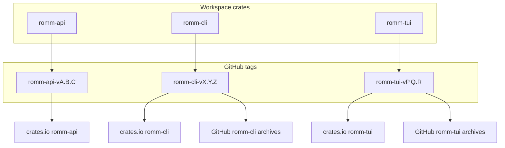

# Release runbook

This workspace ships three independently versioned crates plus prebuilt desktop binaries. See [release coordination design](plans/2026-06-06-release-coordination-design.md) for rationale and industry benchmarks.

## Overview



| Crate | Tag format | Changelog | Binaries | crates.io |
|-------|------------|-----------|----------|-----------|
| `romm-api` | `romm-api-v*` | [romm-api/CHANGELOG.md](../romm-api/CHANGELOG.md) | — | Yes |
| `romm-cli` | `romm-cli-v*` | [romm-cli/CHANGELOG.md](../romm-cli/CHANGELOG.md) | `romm-cli` only | Yes |
| `romm-tui` | `romm-tui-v*` | [romm-tui/CHANGELOG.md](../romm-tui/CHANGELOG.md) | `romm-tui` only | Yes |

Automation: [Release Please](../.github/workflows/release-please.yml) opens release PRs and publishes to crates.io in order (`romm-api` → `romm-tui` → `romm-cli`); [Release Artifacts](../.github/workflows/release-artifacts.yml) builds GitHub release binaries and checksums only.

## Day-to-day development

1. Use [Conventional Commits](https://www.conventionalcommits.org/) with scopes that match the crate:
   - `feat(api):` / changes under `romm-api/` → bumps `romm-api`
   - `feat(cli):` / `romm-cli/` → bumps `romm-cli`
   - `feat(tui):` / `romm-tui/` → bumps `romm-tui`
2. Merge feature PRs to `main`. Release Please opens a combined **release PR** only for components with qualifying commits.
3. Review the release PR for version bumps, dependency pin updates, and changelog entries.

Root-only doc edits (`docs/`, `README.md`) do not trigger a release unless you add a scoped commit (for example `docs(release): note …` with the target component).

## Release checklist

Before merging a release PR:

- [ ] CI is green (fmt, clippy, tests, release preflight)
- [ ] Dependent `Cargo.toml` files show updated `romm-api` pins where applicable
- [ ] Per-crate changelogs look correct
- [ ] If crate versions diverge, add a row to [`docs/compatibility.toml`](compatibility.toml)

After merging:

- [ ] Component tag(s) exist (`romm-<crate>-v*`)
- [ ] [Release Please publish job](../.github/workflows/release-please.yml) completed (`publish-crates-io`)
- [ ] [Release Artifacts](../.github/workflows/release-artifacts.yml) completed for frontend tags
- [ ] crates.io shows the new version(s)
- [ ] Smoke test: download archives and run `romm-cli --version` / `romm-tui --version` as appropriate
- [ ] Optional: `romm-cli update --help` / TUI update flow on a test machine

Local preflight:

```bash
./tools/release-check.sh
```

## Breaking `romm-api` releases

When `romm-api` has a breaking semver bump:

1. Ensure Release Please also bumps or patch-bumps `romm-cli` and `romm-tui` in the same release window (dependency cascade).
2. Publish **romm-api** to crates.io before frontends.
3. Cut frontend releases the same day so `cargo install` never resolves an unpublished API version.

## Hotfix / manual recovery

**Binaries:** use **workflow_dispatch** on [Release Artifacts](../.github/workflows/release-artifacts.yml) with the full tag (for example `romm-cli-v0.40.1`).

**crates.io:** use **workflow_dispatch** on [Release Please](../.github/workflows/release-please.yml) with the release tag/SHA and select which crates to publish (order is enforced automatically).

Local ordered publish:

```bash
export CARGO_REGISTRY_TOKEN=...
./tools/publish-workspace.sh --crates romm-api romm-tui romm-cli
```

## Self-update and binary layout

- **`romm-cli-v*` archives** contain only `romm-cli`.
- **`romm-tui-v*` archives** contain only `romm-tui`.
- Self-update replaces the running binary only; each frontend tracks its own component tag (`romm-cli-v*` or `romm-tui-v*`).

Changelog URLs point to per-crate changelogs; the [root index](../CHANGELOG.md) links to all three.

## Compatibility matrix

When `romm-cli`, `romm-tui`, and `romm-api` versions diverge, record the combination in [`docs/compatibility.toml`](compatibility.toml). CI validates the latest row via `release-check.sh`.

```toml
[[combination]]
romm_cli = "0.40.0"
romm_tui = "0.40.0"
min_romm_api = "0.40.0"
notes = "Initial component-tagged releases"
```

Lockstep releases (all three versions equal) do not require a new row.

## Android (future)

When `android/` lands:

| Artifact | Versioning | Channel |
|----------|------------|---------|
| UniFFI `.so` | Matches `romm-api` semver | Bundled in APK/AAB |
| Android app | Independent `versionName` / `versionCode` | Play Store / sideload |

CI contract (see [android-release.yml](../.github/workflows/android-release.yml)):

- `rommApiVersion` injected from `romm-api/Cargo.toml` at build time
- App manifest declares `minRommApiFfiVersion`
- Release notes cite the compatible `romm-api` range

## Tag migration (one-time)

Historical releases used unified `v0.x.y` tags. New releases use component tags only. To bootstrap from the last unified release at `0.40.0`:

```bash
./tools/bootstrap-component-tags.sh 0.40.0 <commit-sha>
```

See [release coordination design](plans/2026-06-06-release-coordination-design.md) for full migration notes.
