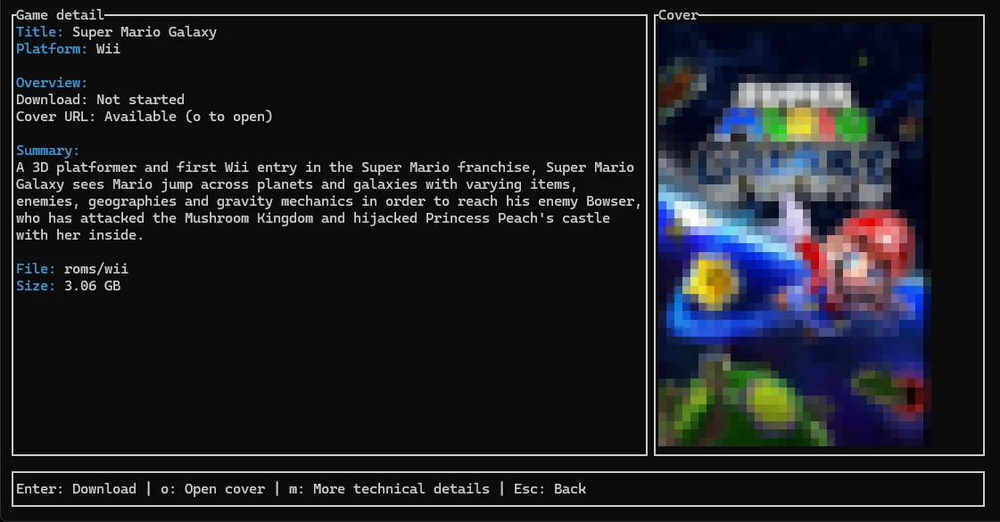
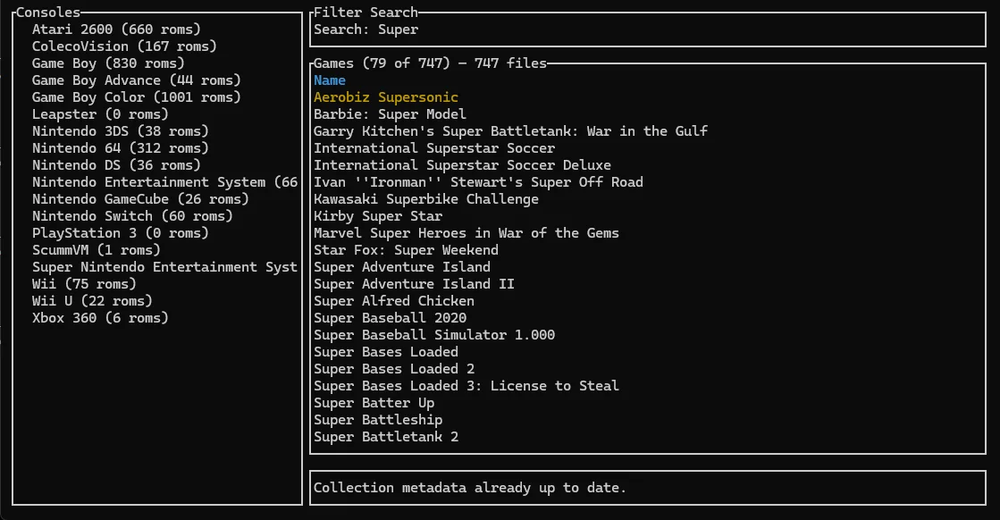

# romm-tui

Terminal UI for browsing and managing a RomM library. Built on [ratatui](https://ratatui.rs/) and [crossterm](https://github.com/crossterm-rs/crossterm). Depends on [`romm-api`](api.md) only (not `romm-cli`).

**Crate path:** `romm-tui/` in the workspace.

---

## Run the TUI

```bash
cargo install romm-tui
romm-tui
```

Prebuilt binaries are on the [Releases page](https://github.com/patricksmill/romm-cli/releases) under `romm-tui-v*` tags.

First launch runs a setup wizard if `config.json` is missing. You can also configure the server from **Settings** or via `romm-cli init` — see **[romm-api configuration](api.md#configuration)**.

On startup, the TUI checks for newer releases (disable with `ROMM_CHECK_UPDATES=false`).

---

## Features

- **Library browsing** — platforms, collections, and ROM lists with search
- **Game detail** — cover-first layout with inline image rendering when the terminal supports it (Kitty, iTerm2, Sixel); halfblocks fallback on Windows Terminal; `o` opens the cover in a browser
- **Background downloads** — start downloads and keep browsing
- **Settings** — auth, paths, appearance, save-sync options
- **Save downloads** — per-console save paths (see [api.md — custom save paths](api.md#custom-console-save-paths))

### Screenshots

#### Game details view



#### Search view



---

## Theming

Built-in theme IDs include `terminal`, `catppuccin`, `dracula`, `nord`, `tokyo-night`, and others from **Settings → Appearance**.

- Set in `config.json` (`theme` field) or `ROMM_THEME` env var
- **Settings → Appearance** — cycle presets with ←/→; **S** saves to `config.json`
- `terminal` — widest compatibility (ANSI named colors)
- RGB presets need a truecolor terminal (Windows Terminal, iTerm2, Alacritty, …)
- `NO_COLOR=1` disables styling

Verbose HTTP logging: `ROMM_VERBOSE=1`.

---

## Library startup

Choosing **Library** from the main menu loads a compact on-disk snapshot of platforms and merged collections (if present) so the list renders without waiting for the network. A background task refetches endpoints, updates the UI, and writes a fresh snapshot. Full ROM lists load on demand and use the ROM list cache.

Override snapshot path with `ROMM_LIBRARY_METADATA_SNAPSHOT_PATH` (default: next to `ROMM_CACHE_PATH`). See [api.md](api.md#environment-variables).

---

## Internals

This section describes the TUI implementation for contributors. Read alongside `cargo doc -p romm-tui --open` and [architecture.md](architecture.md).

### Event loop

The heart of the TUI lives in `romm_tui::tui::app::App::run`:

- Enable raw mode and enter the alternate screen
- Loop: drain background tasks → render → poll keys → dispatch → deferred work

The TUI follows an **Event → Action → update → render** pipeline:

```text
poll_frame_events()     # drain_background_events + crossterm input
  → map_event()         # AppEvent → Action
  → App::update()       # single state-mutation entry point
  → render()            # ratatui draw (screens are render-only)
```

Key modules under `romm-tui/src/tui/`:

| Path | Role |
|------|------|
| `app/event.rs` | `AppEvent`, `Action`, global key mapping |
| `app/update.rs` | Applies actions (navigation, spawns, completions) |
| `app/run.rs` | Thin loop using `runtime.rs` (`TuiSession`) |
| `app/handlers/screen_keys.rs` | Per-screen key → action dispatch |
| `screens/setup_wizard/event.rs` | First-run wizard events |

Public exports: `romm_tui::tui::app::{App, AppScreen}`.

### Screens

Each screen is a struct under `romm-tui/src/tui/screens/`:

- `MainMenuScreen` — entry menu
- `LibraryBrowseScreen` — consoles/collections + ROM list
- `SearchScreen` — text input + results table
- `GameDetailScreen` — detail view for a single ROM
- `DownloadScreen` — overlay showing downloads
- `SettingsScreen` — config summary and editors
- `SetupWizard` — first-run / reconnect flow

`AppScreen` in `tui::app` wraps these so `App` holds one active screen. `StartupSplash` (`screens/connected_splash`) may render before the main menu.

### App module layout

- `app/mod.rs` — `App`, `AppScreen`, `App::new`, key dispatch
- `app/run.rs` — terminal event loop
- `app/render.rs` — frame drawing and global overlays
- `app/background/` — async task completion types and spawn/poll helpers
- `app/handlers/` — one module per screen group
- `app/rom_load.rs` — ROM list fetch and collection prefetch

### Theming implementation

[ratatui-themekit](https://docs.rs/ratatui-themekit) presets via `tui::theme::RommStyles`. Semantic roles (`selection`, `label`, `success`, `error`, `warning`, `muted`) map to theme slots in `romm-tui/src/tui/theme.rs`. Screen renderers take `&RommStyles` instead of hardcoded colors.

### Layout and scrolling

`ratatui::layout::Layout` divides the terminal into `Rect`s (main area + footer; library browser splits horizontally). Scrolling uses a `scroll_offset` index and dynamic visible row counts so the selection stays in the viewport.

---

## Related documentation

- [Changelog](../romm-tui/CHANGELOG.md)
- [romm-api](api.md) — configuration and HTTP client
- [romm-cli](cli.md) — scripting, automation, and `init` / `auth` workflows
- [Architecture overview](architecture.md)
- [Troubleshooting authentication](troubleshooting-auth.md)
